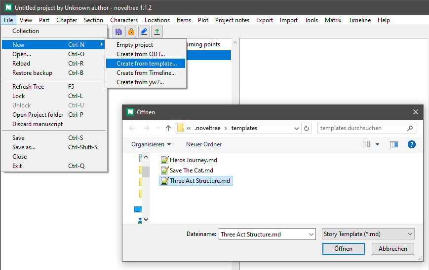

# nv_templates

The [noveltree](https://github.com/peter88213/noveltree/) Python program helps authors organize novels.

*nv_templates* is a plugin for managing Markdown "Story Templates".

## Features

In *noveltree*, you can define a narrative structure with *stages* on two different levels. *nv_templates* faciliates the reuse of narrative structures.

- Load the narrative structure from a Markdown template file:
    - When loading a template into an empty project, a whole story framework is created.
    - When loading a template into a project that has already chapters, a list of stages is created in an "unused" chapter.
- Save the narrative structure to a Markdown template file. 

## Requirements

- [noveltree](https://github.com/peter88213/noveltree/) version 2.0+

## Download and install

[Download the latest release (version 2.0.0)](https://github.com/peter88213/nv_templates/raw/main/dist/nv_templates_v2.0.0.zip)

- Extract the "nv_templates_v2.0.0" folder from the downloaded zipfile "nv_templates_v2.0.0.zip".
- Move into this new folder and launch **setup.pyw**. This installs the plugin for the local user.

---

[Changelog](docs/changelog.md)

## Usage

See the [instructions for use](docs/usage.md)

## License

This is Open Source software, and the *nv_templates* plugin is licensed under GPLv3. See the
[GNU General Public License website](https://www.gnu.org/licenses/gpl-3.0.en.html) for more
details, or consult the [LICENSE](https://github.com/peter88213/nv_templates/blob/main/LICENSE) file.
