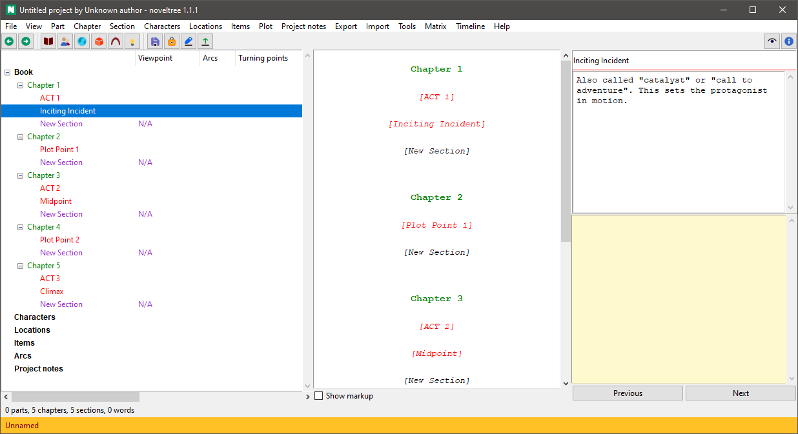

[Project homepage](https://peter88213.github.io/noveltree_templates) > Instructions for use

--- 

A [noveltree](https://peter88213.github.io/noveltree/) plugin for managing Markdown "Story Templates". 

---

# Installation

If [noveltree](https://peter88213.github.io/noveltree/) is installed, the setup script auto-installs the *nv_templates* plugin in the *noveltree* plugin directory.

The plugin adds a **Story Templates** entry to the *noveltree* **Tools** menu, and a **Template plugin Online Help** entry to the **Help** menu. 

---

# Command reference

## File > New

### Create from template

This creates a new project with the narrative structure from a Markdown template file. 

---

## Tools > Story Templates

---

### Load

This loads the narrative structure from a Markdown template file. 

---

### Save

This saves the narrative structure to a Markdown template file. 

---

### Open folder

This opens the templates folder with the OS file manager, so you can manage and edit the templates. 

---

# Conventions

In *noveltree*, you can define a narrative structure with "Todo" Parts, Chapters, and scenes. See [Arcs](https://peter88213.github.io/noveltree/help/arcs). *nv_templates* faciliates the reuse of narrative structures.

## Markdown file structure

The *Story Template* Markdown file defines such a structure with headings and ordinary text.

---

### First level heading for top level stages, e.g. acts

The first level heading begins with `#`, followed by a space and a stage title. 

---

### Second level heading for minor stages or turning points

The second level heading begins with `##`, followed by a space and a stage title. 

---

### Ordinary text

Any text under a heading is used as a description for the element generated from the heading.

---

### Example

```
# ACT 1

Setup

## Inciting Incident

Also called "catalyst" or "call to adventure".
This sets the protagonist in motion.

## Plot Point 1

"Point of no return": The protagonist engages with the action 
the inciting incident has created.

# ACT 2

Confrontation

## Midpoint

The main turning point. A significant event, changing the 
development of things from good to bad, or vice versa.

## Plot Point 2

The aftermath of the Midpoint crisis.
What changes the protagonist from "passenger" to "driver".  

# ACT 3

Resolution

## Climax

The final moment of the story's conflict.

```

This file generates the following structure in an empty project:



---

# License

This is Open Source software, and the *nv_templates* plugin is licensed under GPLv3. See the
[GNU General Public License website](https://www.gnu.org/licenses/gpl-3.0.en.html) for more
details, or consult the [LICENSE](https://github.com/peter88213/noveltree_templates/blob/main/LICENSE) file.
